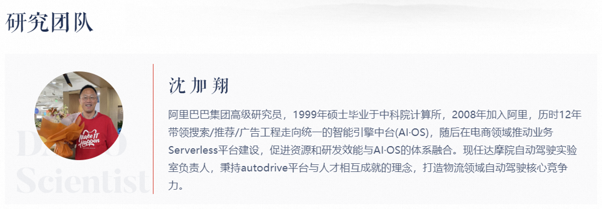

Nanyang Technological University and Alibaba Self-driving Lab are collaborating on autonomous driving technology research. which aims to develop reliable, interpretable, and verifiable autonomous simulation data solutions. The current research directions are as follows:

* Autonomous driving data mining and clustering

* Simulation scenario modeling and generation

* Safety scenario analysis and reconstruction

* Fault injection and adversarial attacks

* Accelerated longtail scenario generation

* Interactive scenario generation

We sincerely welcome more scholars to join our research work . 

TEAM INTRODUCTION
======

The Autopilot Lab is committed to researching the core technologies of autopilot, such as machine learning, integrated design of hardware and software, perception/decision planning/positioning, etc., so as to realize its productization, scale and commercialization, promote industrial reform with technological development, and carry the mission of empowering the important fields of national economy and people's livelihood such as logistics, transportation, safety, and municipal affairs with autopilot technology.

[LEARN MORE ABOUT US](https://damo.alibaba.com/labs/intelligent-transportation)

INDUSTRY INFLUENCE
======

* PROFESSIONAL COMPETITION 

[HIGH-SPEED AUTONOMOUS DRIVING ALGORITHM RACE](https://baijiahao.baidu.com/s?id=1752261226515303589&wfr=baike)

The Management Committee of Shanghai Jinqiao Economic and Technological Development Zone jointly launched the 2022 Global "Future Car" scene Innovation Challenge. Aiming at the high-speed autonomous driving scene, the "intelligent algorithm competition" was set up. The competition questions covered the typical tasks of other car merging, accident detour, low-speed vehicle detour, etc. The participating teams conducted algorithm training and testing based on the Dharma Institute simulation platform.

* TECHNICAL INTERPRETATION 

—— How complicated are the road conditions facing autonomous driving? How to simulate efficiently?

[CLICK HERE TO GET COMPLETE EDITION](https://www.bilibili.com/video/BV1EL411S7Kg/?spm_id_from=333.337.search-card.all.click&vd_source=370e92ee1e3cb377b0f7fde76d7af6f6)

<iframe 
src="../videos/jishujieduyasuo.webm" 
scrolling="no" 
border="0" 
frameborder="no" 
framespacing="0" 
allowfullscreen="true" 
height=600 
width=800> 
</iframe>

ACADEMIC RESEARCH
======

* SOME PUBLICLY AVAILABLE REARCH

——HD Map-based Functional Safety Testing of Autonomous vehicles

Scenario-based testing has been the de facto method for the functional safety verification of autonomous vehicles.

The term "scenario" is commonly defined as:

"... a quantitative description of the relevant characteristics and activities and/or goals of the ego vehicle(s), the static environment, the dynamic environment, and all events that are relevant to the ego vehicle(s) within the time interval between the first and the last relevant event."  (Gelder, E. D. et al. 2022).

A layered structure of scenario elements has been proposed as shown on the right.

     

From the layered model it can be seen that the road level (L1) and Traffic Infrastructures (L2) lays the foundation for scenario elements of higher levels (e.g. L3, L4). 

Hence, L1 and L2 (i.e. HD maps) are the basics for the scenario diversity and efficiency. 

However, it is resource-consuming to construct high quality HD maps, which are, as a result, often overlooked during test scenario construction.
* MORE REARCH

In collaboration with Nanyang Technological University and Alibaba Autonomous Driving Lab, we have conducted the following research aimed at filling the above gaps. An overview of the scene hierarchy model (Bagschik et al. 2018) and the last relevant event. (Gelder, ED, et al., 2022). High-definition map-based functional safety testing of autonomous vehicles, Yun Tang

[TOPOLOGY COVERAGE-GUIDED TESTING](https://flyover202305.github.io//topology-coverage-guided/)

     

[COLLISOIN AVOIDANCE TESTING](https://flyover202305.github.io//collisoin-avoidance/)

[HD MAP GENERATION](https://flyover202305.github.io//HD-map-generation/)

[GENERATE INTERCHANGES](https://flyover202305.github.io//generate-interchanges/)

