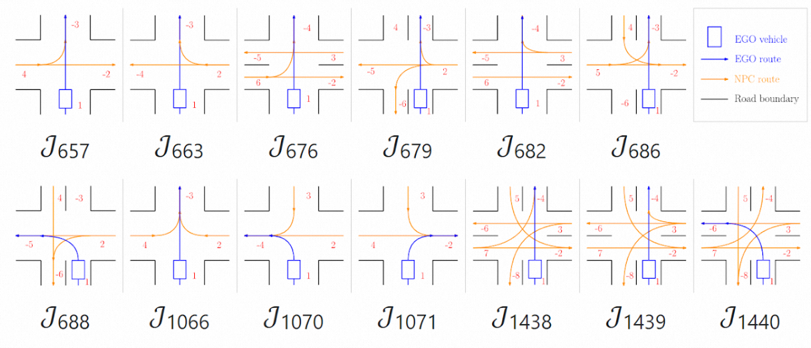
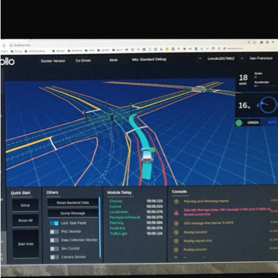
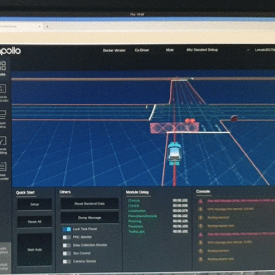
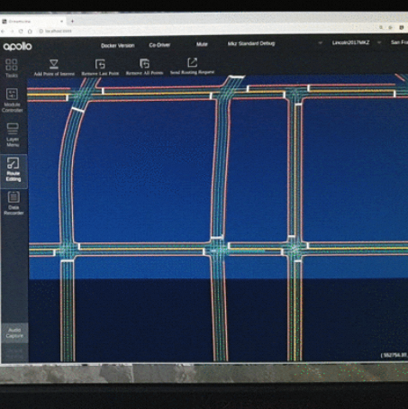



Introduction
======
In city-driving scenarios, collisions often happen in junctions as the connecting lanes of junctions naturally intersects each other. When there is no traffic control (e.g. traffic light or stop signs), vehicles needs to negotiate the right of way before driving through. When such negotiation fails, collision may happen where the traffic lanes intersect. 

We follow the same definition of a route in the previous work (topoloyg coverage-guided testing) but modify a little bit.  For collision avoidance testing, we no longer care about the lane changes behavior (not because it's less important) before and after junctions and included the intersection feature of each junction lanes which EGO veihcle follows during each test case. 

For each junction lane, each intersection point represents a potential collision area on the junction lane. 

The way how the lanes get intersected by other lanes (e.g. angle of intersection, middle or end) potentially represents different types of collision scenairos. 

We define the intersection feature of each junction lane as a set of tuples, each tuple represents the relative intersection direction by another junction lane. (refer to our paper for more details). Essentially, the intersection feature describes the relative directions from which the NPC vehicles may collide with the ego vehicle moving along the junction lane. 

Similar to the previous work, we collect all the junction lanes and classify them into different junction lane groups based on their intersection feature.

The resulted junction lane classes of the San Francisco map is shown below.

Methodology
======
As mentioned earlier, each route contians two roads and one junction. 

We define the following features to classify the junctions:

has_traffic_light

has_stop_sign

has_incoming_crosswalk

has_outgoing_crosswalk

topology feature

The topolgy feature is denoted by the co nectivity of the connected roads and thus represents the direction of the traffic flow through the junction.  

The following diagram visualizes some of the topology features extracted from the San Francisco map. It can be seen that the topology feature not only records the traffic flow information but also implies the shape (i.e. geometry) of the junction. 

We define the following features to model the driving behavior on roads:

number_of_lane_changes_before_junction

number_of_lane_changes_after_junction

The extracted road features are shown below

We then define the route feature to be a combination of road features and junction features and classify routes extracted from the whole map into route groups. 

In each route group, all the route members are considered equivalent in and can be selected as a representative test case.

As a result, duplicated test cases can be elimitated by selecting only one route from each group, and the total number of test cases is significantly reduced while covering the same level of scenario diverisity. 

Below are some of the discovered issues of the open-source Apollo stack:

Failed to change lane

Stuck at stop sign junction

Produced inefficient routing

Readers are referred to the following paper for more details.

Y. Tang et al., "Route Coverage Testing for Autonomous Vehicles via Map Modeling," 2021 IEEE International Conference on Robotics and Automation (ICRA), 2021, pp. 11450-11456, doi: 10.1109/ICRA48506.2021.9560890.[URL](https://ieeexplore.ieee.org/stamp/stamp.jsp?tp=&arnumber=9560890&isnumber=9560666)

<video src="../videos/sample.mp4"></video>

