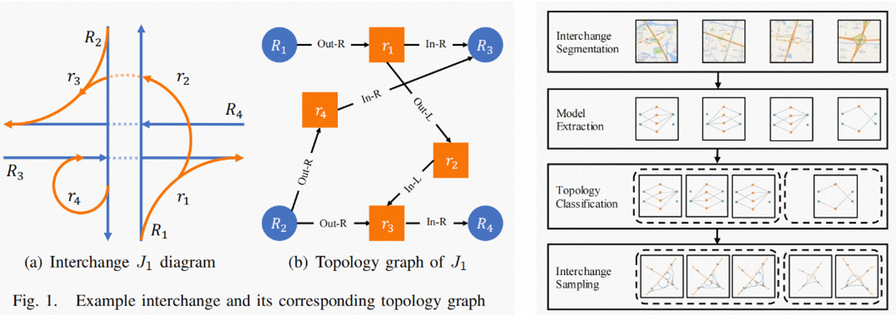
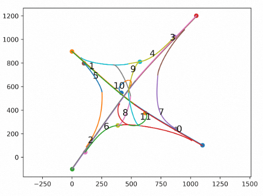



Introduction
======
The complexity of highways mainly lies in highway interchanges due to the diverse connection topology and ramp geometry, which significantly affect the decision-making and motion control of A Vs.

For example, different interchanges may contain a different number of one-way roads. Moreover, a ramp can leave or enter a road or another ramp from the left or right.

Comprehensive A V testing under diverse interchanges is challenging. First, it is risky, resourceconsuming, and even impossible to cover all interchanges in a city physically. On the other hand, even though simulationbased testing provides an efficient way to perform A V testing, it highly relies on HD maps. The lack of a ready-to-use dataset consisting of diverse highway intersections becomes the bottleneck.

To address this issue, we propose a systematic method to generate diverse interchanges with measurable diversity coverage.

FLYOVER
======
A. Modeling of Interchange Topology

We apply labeled digraph to model interchange typologies.

Given an interchange J with n one-way roads and m ramps, its topology model, denoted as GJ = ⟨V, E, T, f⟩. The labels denote how a ramp connects to a road or another ramp. Hence, we have four labels: T = {Out-R, Out-L, In-R, In-L}, where Out-R (resp., Out-L) means the ramp leaves a road/ramp on its right (resp., left), and In-R (resp., In-L) means the ramp merges into a road/ramp from its right (resp., left).

For example, Fig. 1(b) presents the topology model of the interchange J1 (Fig. 1(a)).

B. Topology-Based Interchange Classification

Given two interchanges J and J ′, and their topology models G = ⟨V, E, T, fE⟩ and G′ = ⟨V ′, E′, T ′, f ′E⟩, G and G′ are isomorphic, denoted as G ≌ G′, if there exists a bijective function g : V → V ′ such that: (1) ∀u, v ∈ V , (u, v) ∈ E ⇔ (g′(u), g′(v)) ∈ E′, and (2) ∀(u, v) ∈ E, fE(u, v) = f ′E(g(u), g(v)).

J and J ′ are called topology isomorphism. Two interchanges J1 and J2 are topology equivalent if they are topology isomorphism.

According to the above definitions, we can classify interchanges into different equivalency classes.

C. Coverage-Guided Interchange Sampling

* In this paper, we mainly focus on the planning and control modules of an A V , so we identify the following features:

* the number of lanes for a one-way road, which affects the local trajectory computation of an A V

* minimum radius of a ramp, which determines the speed limit of the ramp

* maximum longitudinal slope of a ramp, which has a significant impact on the throttle control of an A V

Meanwhile, to preserve the geometrical diversity while minimizing duplication, we opt for 2-way combinations to balance the combinatorial coverage and the number of generated interchanges.

  
Examples of Generated Interchanges
======

In our example, we search for the interchanges in Hangzhou using the keyword “highway interchange” on the GaoDe map, resulting in 39 interchanges in 2D space.

We then apply FLYOVER to normalize the interchanges’ locations, construct their topology models, and classify them into 21 topology-equivalency classes. For each class, FLYOVER uses 2-way combinatorial sampling and differential evolution to generate 1443 interchange samples. The detailed statistic data is given in Table. I.

  

This is the Dataset Generation Pipeline：

To illustrate the diversity and applicability of the generated interchange dataset, we test the built-in traffic flow control algorithm in SUMO and the fuel-optimization trajectory tracking algorithm deployed to Alibaba’s autonomous trucks on the dataset. The results show that except for the geometrical difference, the interchanges are diverse in throughput and fuel consumption under the traffic flow control and trajectory tracking algorithms, respectively. 

or more details, please refer to our following papers:

Yuan Zhou, Gengjie Lin, Yun Tang,  "FLYOVER: A Model-Driven Method to Generate Diverse Highway Interchanges for Autonomous Vehicle Testing," which is Accepted by ICRA  2023

https://doi.org/10.48550/arXiv.2301.12738

Here you can download our dataset:  https://ntutangyun.github.io/highway-interchange-dataset-website/ 

