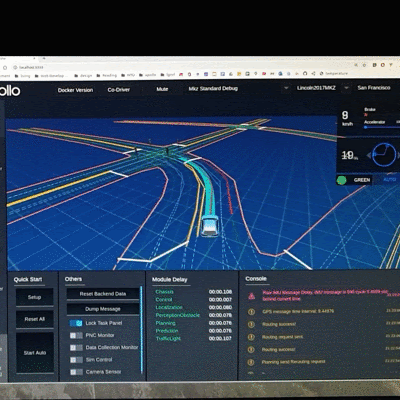



Introduction
======
The first step to testing scenarios generation is to construct the road networks where all the traffic participants (e.g. EGO vehicle, NPC vehicles, pedestrians etc.) move.

In city-driving scenarios, the two most common elements of the road networks are the roads and junctions (including roundabouts). 

The dynamic driving tasks of the EGO vehicle usually involves starting from any road side, driving through various junctions and reaching the destination at another road side. Such a route can be decomposed into a sequence of unit routes, each including a start point on one road, one junction to drive through and an end point on another road (i.e. the other side of the junciton). 

Once we have the definition of unit routes, we can then extract all the possible routes given a city-driving map and treat each route as a testing scenario. 

But here comes the issue of redundancy. 

For example, for the San Francisco map provided by LG SVL, we noticed that over 90% of the routes extracted have similar roads and junction structures. This leads to large amount of duplicated test cases, thus waste of testing efforts. 

To solve this, a way to classify routes need to be proposed to quantitatively group test cases and identify representives test cases from each group. 

Methodology
======
As mentioned earlier, each route contians two roads and one junction. 

We define the following features to classify the junctions:

* has_traffic_light

* has_stop_sign

* has_incoming_crosswalk

* has_outgoing_crosswalk

* topology feature

The topolgy feature is denoted by the co nectivity of the connected roads and thus represents the direction of the traffic flow through the junction.  

The following diagram visualizes some of the topology features extracted from the San Francisco map. It can be seen that the topology feature not only records the traffic flow information but also implies the shape (i.e. geometry) of the junction. 

We define the following features to model the driving behavior on roads:

* number_of_lane_changes_before_junction

* number_of_lane_changes_after_junction

The extracted road features are shown below

We then define the route feature to be a combination of road features and junction features and classify routes extracted from the whole map into route groups. 

In each route group, all the route members are considered equivalent in and can be selected as a representative test case.

As a result, duplicated test cases can be elimitated by selecting only one route from each group, and the total number of test cases is significantly reduced while covering the same level of scenario diverisity. 

Below are some of the discovered issues of the open-source Apollo stack:

* Failed to change lane

* Stuck at stop sign junction

* Produced inefficient routing

Readers are referred to the following paper for more details.

Y. Tang et al., "Route Coverage Testing for Autonomous Vehicles via Map Modeling," 2021 IEEE International Conference on Robotics and Automation (ICRA), 2021, pp. 11450-11456, doi: 10.1109/ICRA48506.2021.9560890.[URL](https://ieeexplore.ieee.org/stamp/stamp.jsp?tp=&arnumber=9560890&isnumber=9560666)

