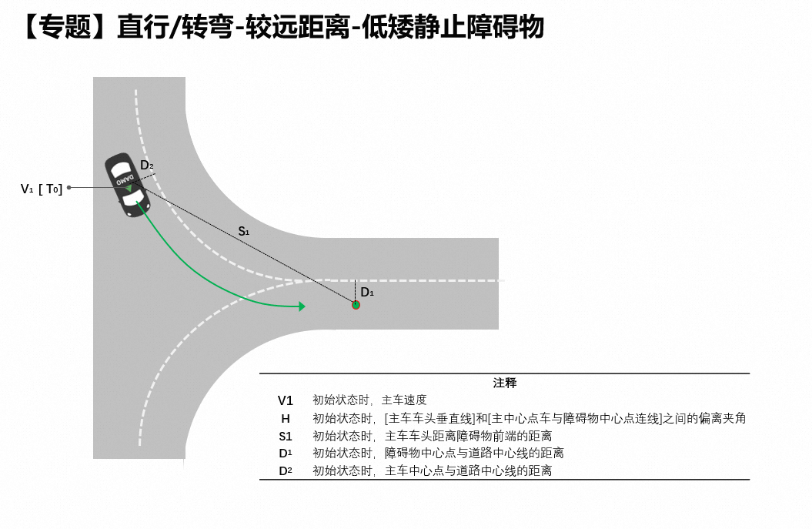

In city-driving scenarios, collisions often happen in junctions as the connecting lanes of junctions naturally intersects each other. When there is no traffic control (e.g. traffic light or stop signs), vehicles needs to negotiate the right of way before driving through. When such negotiation fails, collision may happen where the traffic lanes intersect. 

We follow the same definition of a route in the previous work (topoloyg coverage-guided testing) but modify a little bit.  For collision avoidance testing, we no longer care about the lane changes behavior (not because it's less important) before and after junctions and included the intersection feature of each junction lanes which EGO veihcle follows during each test case. 

For each junction lane, each intersection point represents a potential collision area on the junction lane. 

The way how the lanes get intersected by other lanes (e.g. angle of intersection, middle or end) potentially represents different types of collision scenairos. 

We define the intersection feature of each junction lane as a set of tuples, each tuple represents the relative intersection direction by another junction lane. (refer to our paper for more details). Essentially, the intersection feature describes the relative directions from which the NPC vehicles may collide with the ego vehicle moving along the junction lane. 

Similar to the previous work, we collect all the junction lanes and classify them into different junction lane groups based on their intersection feature.

The resulted junction lane classes of the San Francisco map is shown below.
111

Heading 1
======

Heading 2
======

Heading 3
======
